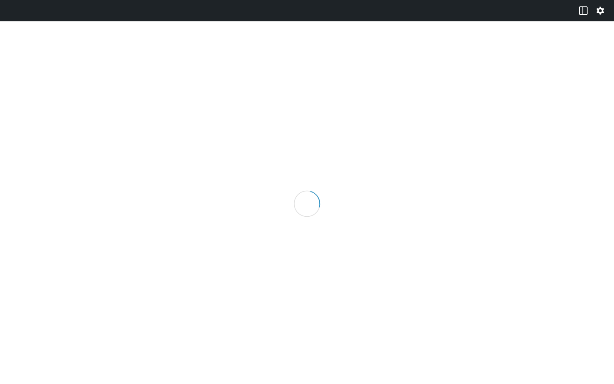

# Screenshot Automation with WordPress Playground

## Overview

This plugin uses **Playwright + WordPress Playground + Blueprint** to automatically generate screenshots for documentation and the WordPress.org plugin directory.

## How It Works

The screenshot automation system:

1. **Loads WordPress Playground** with our working blueprint via CORS server
2. **Uses demo content** from the blueprint (no manual setup needed)
3. **Captures screenshots** of the plugin in action
4. **Saves to multiple locations** for both WordPress.org and GitHub docs

## Key Benefits

✅ **Uses real working demo** - Blueprint includes pre-configured XFN examples
✅ **Automated process** - One command captures all screenshots
✅ **Dual output** - Saves to both `.wordpress-org/` and `docs/images/`
✅ **Consistent quality** - Same viewport size and settings every time
✅ **Easy updates** - Re-run after UI changes to regenerate screenshots

## Prerequisites

### 1. Install Dependencies

```bash
npm install
```

This installs Playwright and Chromium browser.

### 2. Start CORS Server

The blueprint must be served with CORS headers:

```bash
python3 cors-server.py
```

This runs at `http://localhost:8000` and serves the blueprint with proper headers.

## Usage

### Generate Screenshots

With the CORS server running, execute:

```bash
npm run screenshots
```

**What happens:**
1. Launches Chromium browser (visible by default)
2. Loads WordPress Playground with blueprint from localhost:8000
3. Waits for demo page to load at `/xfn-demo/`
4. Captures screenshot of demo page
5. Saves to both directories

**Time:** ~60-90 seconds

### Screenshot Files Generated

| File | Description | Used For |
|------|-------------|----------|
| `.wordpress-org/screenshot-1.png` | Demo page with XFN examples | WordPress.org plugin directory |
| `docs/images/screenshot-1.png` | Same screenshot | GitHub documentation |

## Current Screenshots

### Screenshot 1: Demo Page
Shows the WordPress Playground live demo with:
- Button with `rel="friend met colleague"`
- YouTube embed with `data-xfn-rel="friend met"`
- Inline links with multiple XFN attributes
- Testing instructions and DevTools guide

**Size:** 1440x900 (optimized for web viewing)

## Adding More Screenshots

To capture additional screenshots, edit `screenshots/capture.js`:

1. Add new capture functions for specific UI states
2. Navigate to different editor views (Inspector Controls, Link popover, etc.)
3. Call `captureScreenshot(page, 'screenshot-2.png')`
4. Update `readme.txt` with new screenshot descriptions

**Example:**
```javascript
// Screenshot 2: Inspector Controls
await selectButtonBlock(frame);
await openXfnInspectorPanel(frame);
await captureScreenshot(page, 'screenshot-2.png');
```

## Configuration

Edit `screenshots/capture.js` to customize:

```javascript
const CONFIG = {
  blueprintUrl: 'http://localhost:8000/assets/blueprints/blueprint.json',
  outputDir: path.join(__dirname, '..', '.wordpress-org'),
  docsImageDir: path.join(__dirname, '..', 'docs', 'images'),
  viewport: {
    width: 1440,
    height: 900
  },
  timeout: 120000
};
```

**Options:**
- `viewport`: Screenshot dimensions
- `timeout`: Max wait time for Playground to load
- `headless`: Set to `true` in `browser.launch()` to run without visible browser

## Troubleshooting

### CORS Errors

**Problem:** `Failed to fetch` blueprint from localhost
**Solution:** Start CORS server: `python3 cors-server.py`

### Playground Doesn't Load

**Problem:** Timeout waiting for Playground
**Solution:**
- Increase `timeout` value in CONFIG
- Check internet connection (Playground needs to download WordPress)
- Try restarting the CORS server

### Screenshots Look Wrong

**Problem:** Elements not visible or cut off
**Solution:**
- Increase wait times in script (`setTimeout` values)
- Adjust viewport dimensions in CONFIG
- Check that blueprint demo content is correct

### Browser Closes Unexpectedly

**Problem:** "Target page, context or browser has been closed"
**Solution:**
- Simplify iframe interactions
- Add more wait time after navigation
- Check browser console for JavaScript errors

## WordPress.org Integration

### Screenshot Naming Convention

WordPress.org expects screenshots named:
- `screenshot-1.png` - Primary screenshot (always shown)
- `screenshot-2.png` - Secondary screenshot
- `screenshot-3.png` - Additional screenshot
- etc.

### Screenshot Descriptions

Descriptions are in `readme.txt` under `== Screenshots ==`:

```
== Screenshots ==

1. Live demo in WordPress Playground showing XFN in action
2. Inspector Controls panel with XFN Relationships options
3. Link Advanced Panel with collapsible XFN section
```

**Order matches:** `screenshot-1.png` = Description #1

## Updating Screenshots

When making UI changes:

1. Make code changes to plugin
2. Run `npm run build` to compile
3. Update blueprint if demo content needs changes
4. Start CORS server: `python3 cors-server.py`
5. Generate screenshots: `npm run screenshots`
6. Review in both directories:
   - `.wordpress-org/screenshot-1.png`
   - `docs/images/screenshot-1.png`
7. Commit updated screenshots to git
8. Deploy to WordPress.org (screenshots update automatically)

## Documentation References

### GitHub README.md

```markdown

```

### docs/README.md

```markdown

```

### readme.txt (WordPress.org)

```
== Screenshots ==

1. Live demo in WordPress Playground showing XFN in action
```

WordPress.org automatically displays `screenshot-1.png` with this description.

## Technical Architecture

```
┌─────────────────────┐
│   Playwright        │
│   (Node.js)         │
└──────────┬──────────┘
           │
           ├─→ Launches Chromium
           │
           ├─→ Loads Playground URL with blueprint-url parameter
           │
           ↓
┌─────────────────────┐
│  WordPress          │
│  Playground         │ ← Fetches blueprint.json via CORS
│  (Browser)          │
└──────────┬──────────┘
           │
           ├─→ Executes blueprint steps
           ├─→ Installs plugin from WordPress.org
           ├─→ Creates demo page
           ├─→ Lands at /xfn-demo/
           │
           ↓
┌─────────────────────┐
│  Screenshot         │
│  Capture            │ ← page.screenshot()
└──────────┬──────────┘
           │
           ├─→ Saves to .wordpress-org/screenshot-1.png
           └─→ Saves to docs/images/screenshot-1.png
```

## Benefits Over Manual Screenshots

| Manual Screenshots | Automated Screenshots |
|-------------------|----------------------|
| Time-consuming to capture | One command to regenerate |
| Inconsistent sizing | Same size every time |
| Need test environment | Uses Playground (no setup) |
| Separate for docs vs WP.org | Saves to both automatically |
| Hard to reproduce | Reproducible from blueprint |

## Future Enhancements

Potential improvements:

- [ ] Capture Inspector Controls panel (screenshot-2.png)
- [ ] Capture Link Advanced Panel (screenshot-3.png)
- [ ] Add DevTools view showing HTML with XFN attributes
- [ ] Automate screenshot optimization (compression)
- [ ] Generate multiple viewport sizes (desktop, tablet, mobile)
- [ ] Add screenshot diffing to detect UI changes
- [ ] Create video demo from Playwright recording

## Related Files

- `screenshots/capture.js` - Main Playwright script
- `screenshots/README.md` - Screenshot automation docs
- `cors-server.py` - CORS-enabled HTTP server for blueprint
- `assets/blueprints/blueprint.json` - Working blueprint with demo
- `.wordpress-org/` - WordPress.org assets directory
- `docs/images/` - GitHub documentation images
- `readme.txt` - WordPress.org plugin readme (screenshot descriptions)

## Learn More

- [Playwright Documentation](https://playwright.dev/)
- [WordPress Playground](https://wordpress.github.io/wordpress-playground/)
- [Blueprint API Reference](https://wordpress.github.io/wordpress-playground/blueprints-api/)
- [WordPress.org Plugin Guidelines](https://developer.wordpress.org/plugins/wordpress-org/plugin-assets/)

---

**Last Updated:** 2024-12-09
**Version:** 1.0.3
**Status:** ✅ Working and tested
