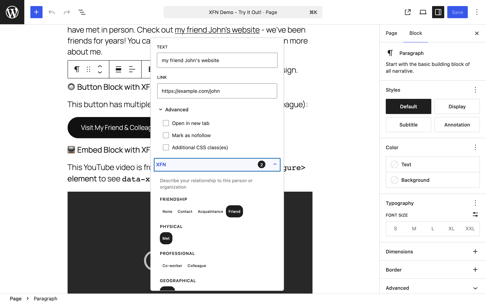
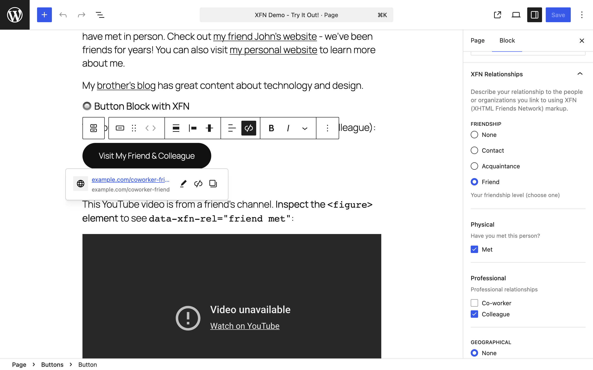

Add your first XFN relationship to a link and see the result on your site.

## What XFN is, in one minute

[XFN (XHTML Friends Network)](https://gmpg.org/xfn/) lets you say how you know the person behind a link. When you tag a link with values like `friend` or `colleague`, the plugin writes them into the link's standard HTML `rel` attribute — for example `<a href="https://example.com" rel="friend met">`. That's visible to anyone reading your page source and to tools that parse XFN. Nothing is sent anywhere; the data lives in your post content.

There are 18 relationship values in 7 categories. Some categories let you pick only one value (radio buttons), others allow several (checkboxes):

| Category | Rule | Values |
|---|---|---|
| Friendship | choose one | contact, acquaintance, friend |
| Physical | checkbox | met |
| Professional | multiple allowed | co-worker, colleague |
| Geographical | choose one | co-resident, neighbor |
| Family | choose one | child, parent, sibling, spouse, kin |
| Romantic | multiple allowed | muse, crush, date, sweetheart |
| Identity | checkbox | me |

## First task: tag an inline link

This works out of the box — no settings needed.

1. Edit a post. In a Paragraph block, select some text and press Cmd/Ctrl+K to add a link. Enter a URL and confirm.
   - Expected: the text becomes a link.
2. Click the link to open the link popover, then expand **Advanced**.
   - Expected: below the standard options you see a collapsible **XFN** section. A count badge shows how many relationships are active (0 so far).
3. Expand the XFN section and pick relationships — for example Friendship: friend, and Physical: met.
   - Expected: your selections appear as small "Active Relationships" pills, and the count badge updates.
4. Click Apply (or Save/Submit in the popover), then save the post.
   - Expected: the relationships are written to the link's `rel` attribute in the post content.
5. View the published post, right-click the link, and choose Inspect (browser developer tools).
   - Expected: the anchor shows `rel="friend met"`.

For a deeper walkthrough of this flow, see [Paragraph links](https://github.com/courtneyr-dev/link-extension-for-xfn/blob/main/docs/paragraph-links.md).

## Second task: tag a block-level link (optional)

Blocks that are themselves links — Button, Image, Navigation Link, Site Logo, Post Title, Query Title, Embed — use a sidebar panel instead of the link popover. That panel is off by default:

1. Go to Settings → Link Extension for XFN.
2. Check **Inspector Controls** and click Save Changes.
3. Back in the editor (refresh it), select a Button block with a URL set.
   - Expected: an "XFN Relationships" panel appears in the right-hand sidebar with the same category groups.

See [Settings](/link-extension-for-xfn/settings/) for details, and [Button links](https://github.com/courtneyr-dev/link-extension-for-xfn/blob/main/docs/button-links.md) for the full workflow.

## Common first-run confusion

- **Nothing looks different after activating.** That's expected — the plugin adds no visible output until you tag a link, and the editor controls are tucked inside the link popover's Advanced section.
- **No XFN panel in the sidebar.** The Inspector Controls panel is off by default. Enable it at Settings → Link Extension for XFN.
- **No tooltips on the frontend.** The hover/focus tooltip that shows a link's relationships is gated to WordPress 7.0 or later. On WordPress 6.9 and earlier it doesn't appear — your `rel` attributes are still saved and visible in the page source.
- **Relationships and old versions.** Version 1.0.4 fixed cases where relationships were dropped when saving offline or linking to hosts that don't resolve, and fixed frontend tooltips that never loaded in 1.0.3. If you're on an older version, update.
