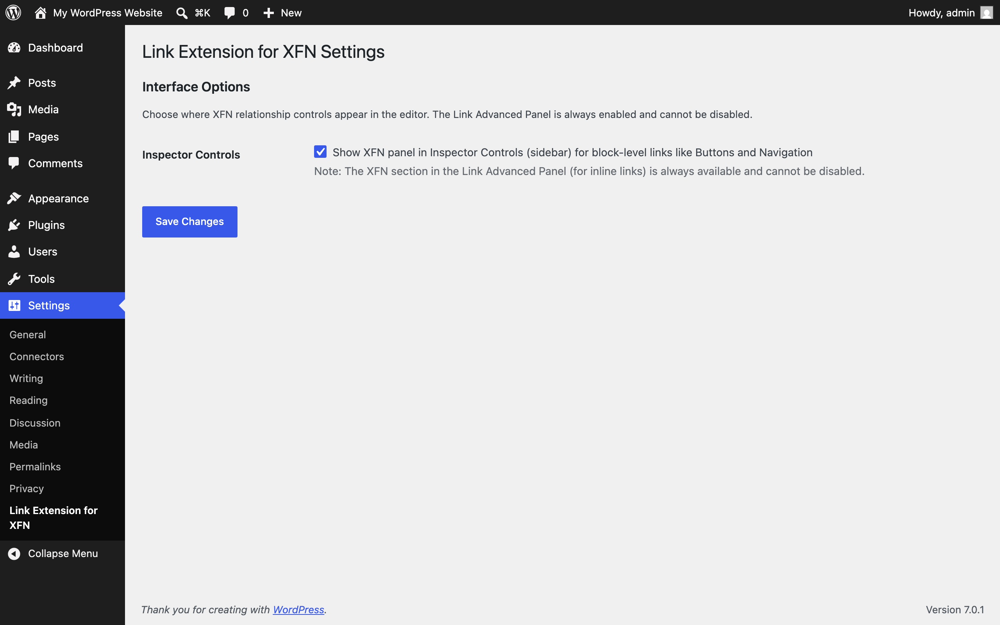
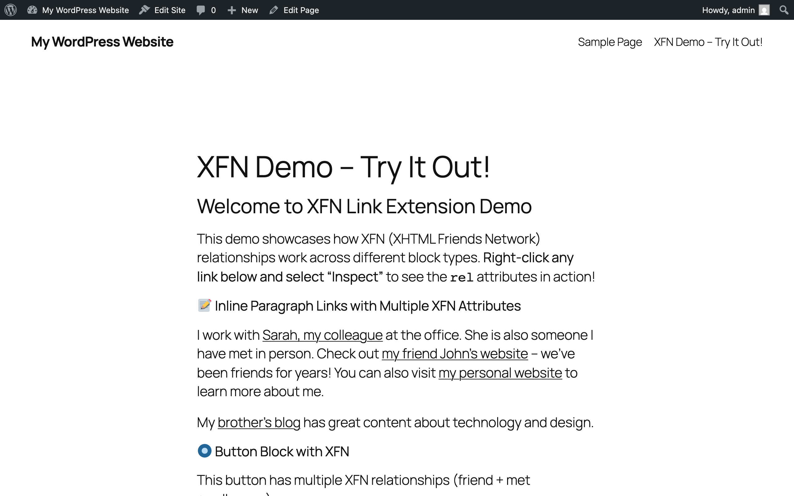
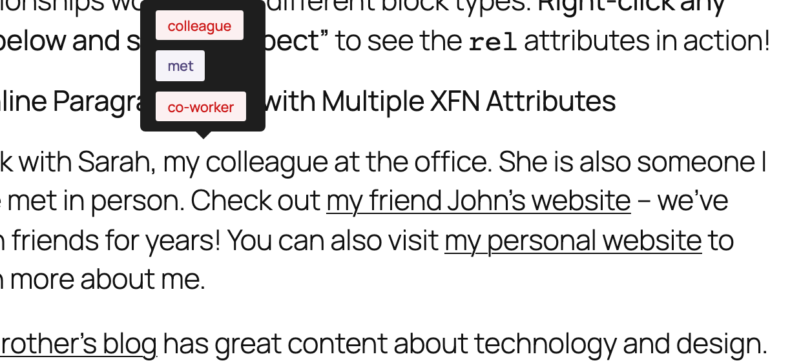
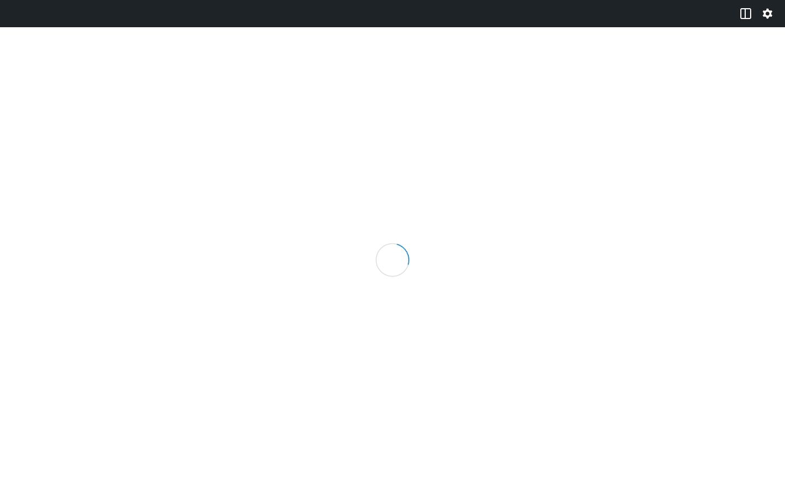

The screens Link Extension for XFN adds to WordPress. Every screenshot has a text equivalent in the page that documents the task, so you never need the image to follow the instructions.

Screenshots come from the repeatable capture script (`npm run screenshots:docs`, which runs against a disposable WordPress Playground using the plugin's demo blueprint). Manual captures still needed are specified at the end of this page.

## Admin

**Settings → Link Extension for XFN**: the Inspector Controls toggle. The link popover's Advanced panel is always on and has no setting. See [Settings](/link-extension-for-xfn/settings/).

## Front end

The `/xfn-demo/` page the Playground blueprint publishes: inline links and buttons carrying XFN relationships. See [Playground preview](/link-extension-for-xfn/playground/).

The frontend tooltip on WordPress 7.0+: hovering or focusing an XFN link shows its relationships as pills. See [FAQ](/link-extension-for-xfn/faq/) for the version gate.

The demo page in WordPress Playground, showing relationships across block types.

## Screenshots still needed

Each row is the full capture specification (1280×800 at 2x; the blueprint's demo content provides the tagged links).

| Filename | Screen and state | What to highlight | Alt text | Caption |
| --- | --- | --- | --- | --- |
| editor-link-advanced-xfn.png | Link popover on a paragraph link, Advanced expanded, XFN section open with friend + met selected | The count badge and button groups | Link popover Advanced section showing the collapsible XFN area with a count badge and relationship button groups | Tag an inline link without leaving the popover. |
| editor-inspector-controls-button.png | Inspector Controls panel on a Button block with friend, met, colleague selected | The radio/checkbox groups and pills | XFN Relationships sidebar panel showing radio and checkbox groups with selected relationship pills | Block-level links get a full sidebar panel. |
| editor-active-pills.png | Any block-level link with three or more relationships selected | The pill summary | Editor pill summary listing the active XFN relationships for a link | Confirm active relationships at a glance. |
| frontend-rel-devtools.png | Browser DevTools inspecting a demo-page anchor | rel="colleague met co-worker" | Browser developer tools showing an anchor element with XFN values in its rel attribute | The relationships live in the standard rel attribute. |
| frontend-blogroll-block.png | XFN Blogroll block on a published page, grouped by relationship | The relationship group headings | XFN Blogroll block grouping linked sites under relationship headings with counts | Turn your tagged links into a blogroll. |
| frontend-relationship-badge.png | Relationship Badge block with a matching URL | The badge pills | Relationship Badge block showing a URL with its XFN relationship pills | Show how you know one specific site. |
| frontend-relationship-directory.png | Relationship Directory block with search and filters on | The filter buttons | Relationship Directory block with a search box, relationship filter buttons, and a filtered list of links | Browse every relationship on your site. |

Capture notes: the tooltip shot needs WordPress 7.0+ and a logged-in fetch (an unauthenticated first request gets Playground's auto-login redirect). The three block shots need published posts containing tagged links; the site-wide scan caches for about five minutes.
