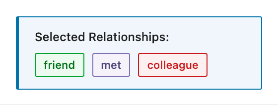
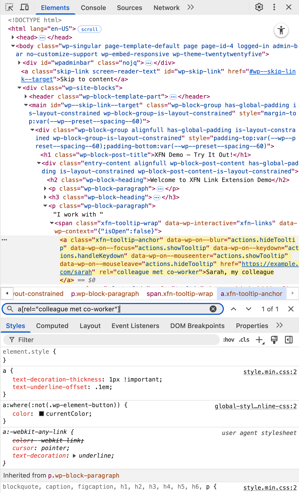
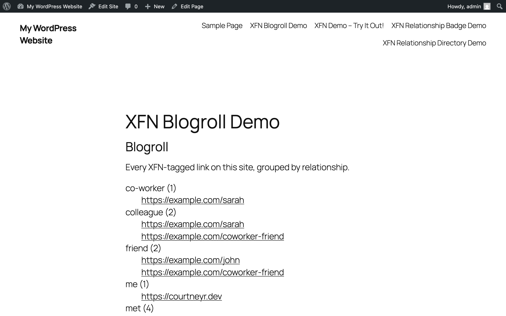
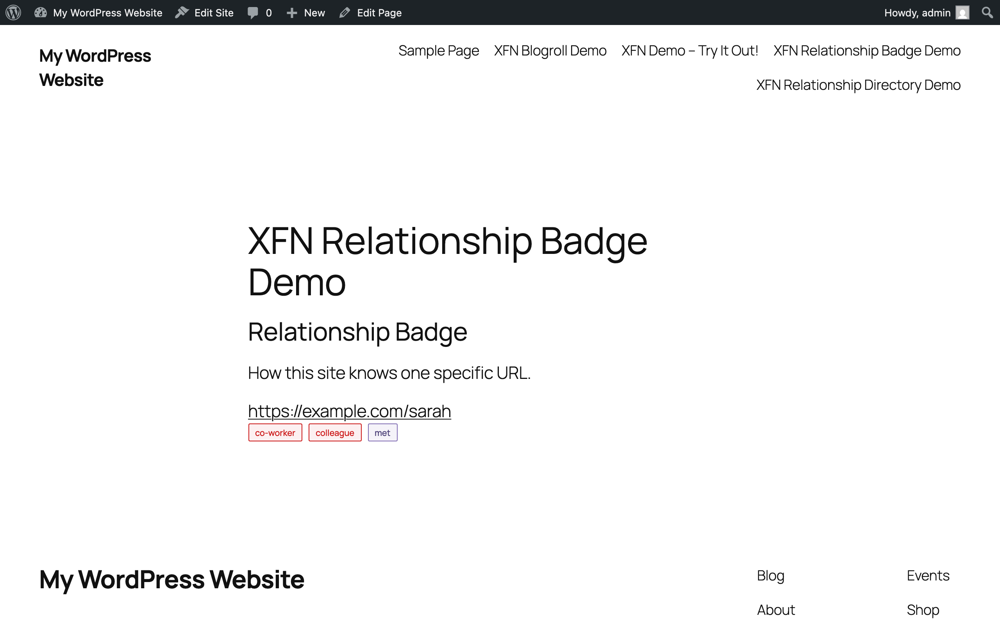
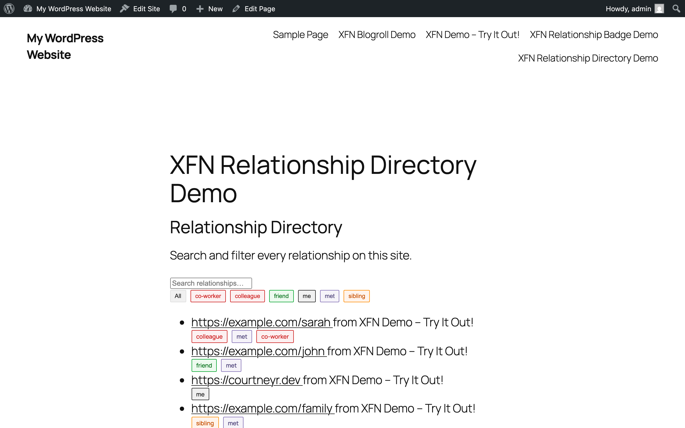

The screens Link Extension for XFN adds to WordPress. Every screenshot has a text equivalent in the page that documents the task, so you never need the image to follow the instructions.

Screenshots come from the repeatable capture script (`npm run screenshots:docs`, which runs against a disposable WordPress Playground using the plugin's demo blueprint).

## Admin

**Settings → Link Extension for XFN**: the Inspector Controls toggle. The link popover's Advanced panel is always on and has no setting. See [Settings](/link-extension-for-xfn/settings/).

## Editor

Tag an inline link without leaving the popover. See [Common tasks](/link-extension-for-xfn/common-tasks/).

Block-level links get a full sidebar panel. See [Settings](/link-extension-for-xfn/settings/).

Confirm active relationships at a glance.

## Front end

The `/xfn-demo/` page the Playground blueprint publishes: inline links and buttons carrying XFN relationships. See [Playground preview](/link-extension-for-xfn/playground/).

The frontend tooltip on WordPress 7.0+: hovering or focusing an XFN link shows its relationships as pills. See [FAQ](/link-extension-for-xfn/faq/) for the version gate.

The demo page in WordPress Playground, showing relationships across block types.

The relationships live in the standard rel attribute. See [Common tasks](/link-extension-for-xfn/common-tasks/).

Turn your tagged links into a blogroll. See [Common tasks](/link-extension-for-xfn/common-tasks/).

Show how you know one specific site. See [Common tasks](/link-extension-for-xfn/common-tasks/).

Browse every relationship on your site. See [Common tasks](/link-extension-for-xfn/common-tasks/).
