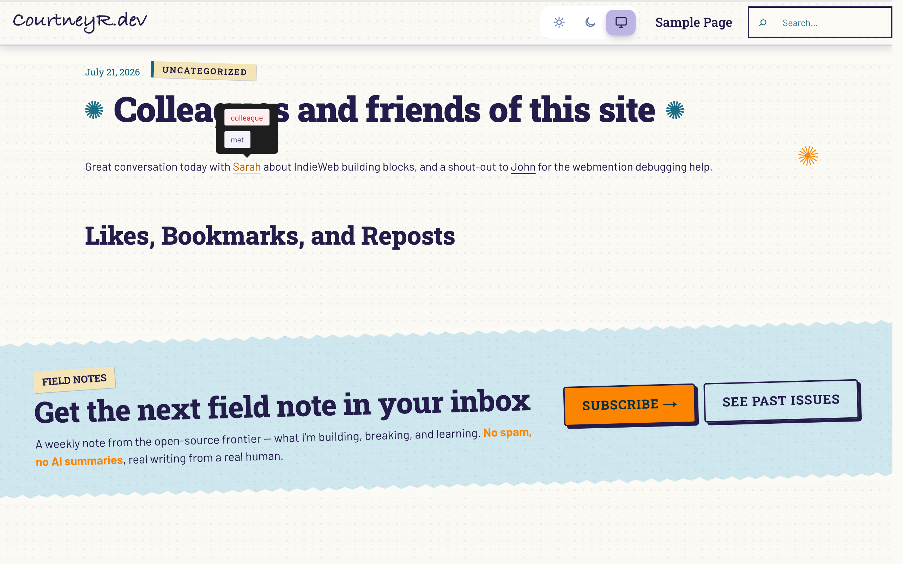
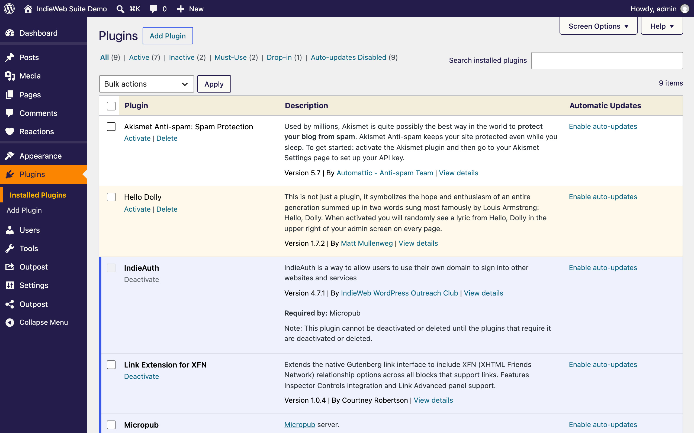

Link Extension for XFN is part of a small suite of IndieWeb plugins that coexist cleanly on one site: [Post Kinds for IndieWeb in Block Themes](https://courtneyr-dev.github.io/post-kinds-for-indieweb/), [Post Formats for Block Themes](https://courtneyr-dev.github.io/post-formats-for-block-themes/), and the [Outpost composer](https://courtneyr-dev.github.io/outpost/). Each plugin works alone; none of them requires the others.

The screenshots on this page come from a demo site running the whole suite with a styled block theme, so they show what readers see on a real site rather than a default install.

## Relationships render on any styled theme

The frontend tooltip works the same on a styled theme as on a default one: hovering or focusing a tagged link shows its relationships as pills. Because the data lives in the standard `rel` attribute, the theme's typography and colors apply to the surrounding post while the tooltip stays legible — and posts of any format or kind (notes, quotes, listens) can carry tagged links.

## One suite, one plugins screen

The full IndieWeb stack active on one site: the suite plus the IndieAuth, Micropub, and Webmention building blocks. XFN tagging keeps working in every context the other plugins create — replies composed in Outpost, card posts from Post Kinds, or format-patterned posts from Post Formats.

## What each plugin adds

- **Link Extension for XFN** — this plugin: relationship attributes on links, tooltips, blogroll and directory blocks.
- **Post Kinds for IndieWeb** — card blocks and microformats for listens, watches, reads, check-ins, and more.
- **Post Formats for Block Themes** — format patterns, detection, badges, and templates.
- **Outpost** — a phone-friendly composer that publishes via Micropub; links in its posts can be tagged with XFN once the post is on your site.
